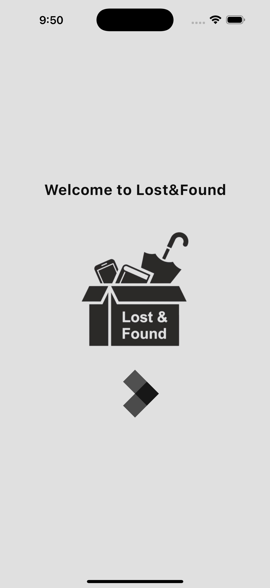
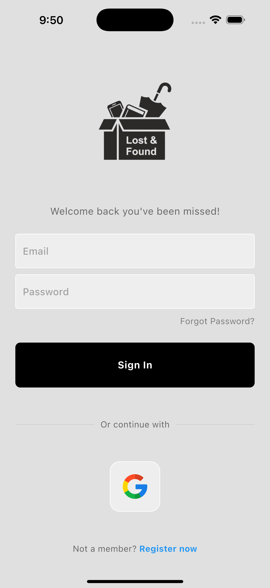
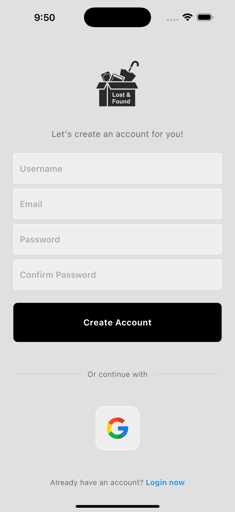
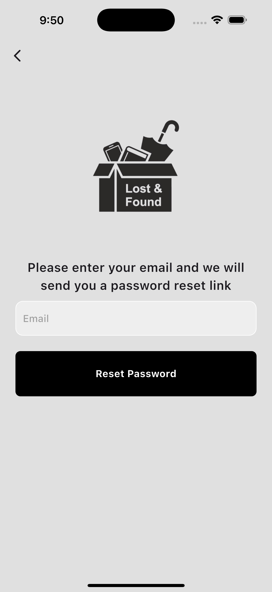
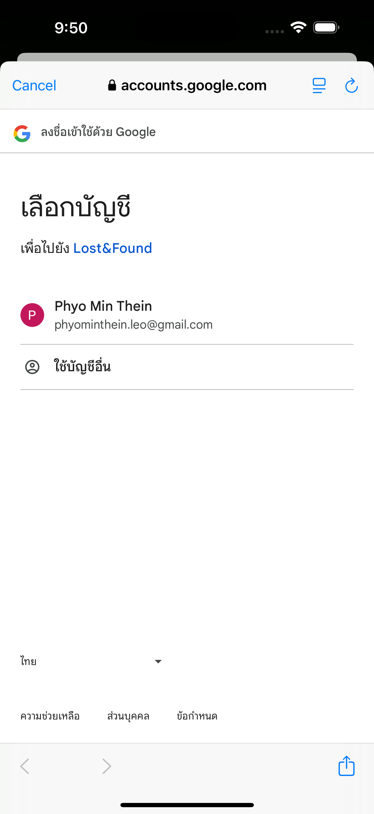
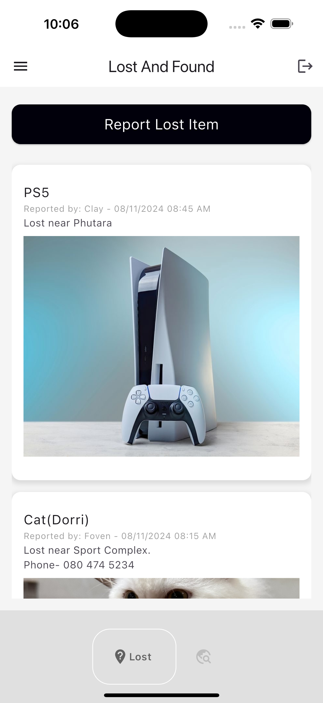
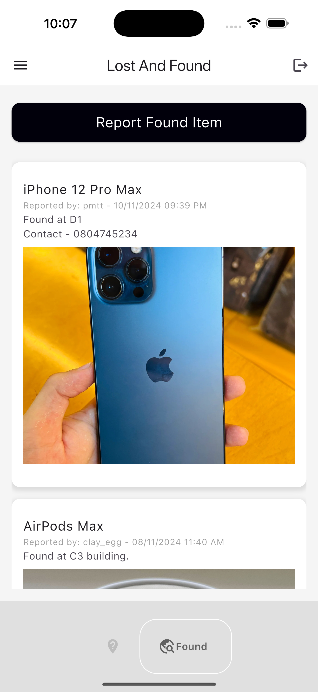
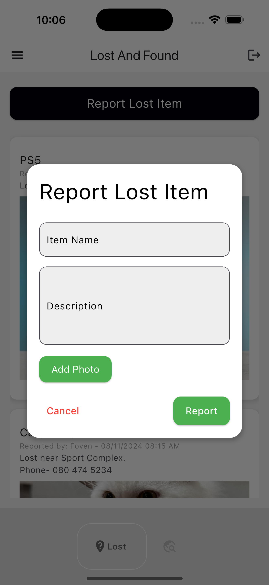
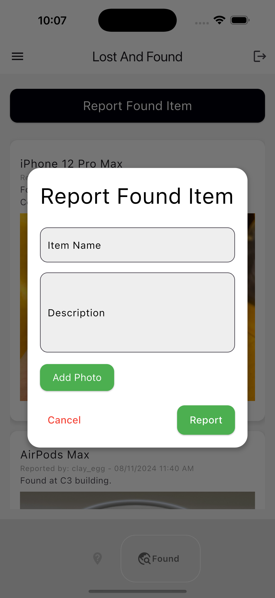

# Lost and Found

[](https://flutter.dev/)
[](https://firebase.google.com/)
[](LICENSE)

A mobile app built with Flutter to help people report **lost** and **found** items. It allows users to log in, report items they’ve lost, or found, upload images, and view posts from other users. The app utilizes **Firebase** for authentication and data storage, and **ImgBB** for image hosting.

## Features

- **User Authentication**: Firebase Auth for login and sign-up.
- **Lost Item Reporting**: Report lost items with descriptions and images.
- **Found Item Reporting**: Report found items with descriptions and images.
- **Real-Time Updates**: Items are stored in Firebase Firestore and updated in real-time.
- **Image Upload**: Images of lost/found items uploaded to ImgBB and displayed in the app.

## Screenshots

Loading Screen

 

Login Page

 

Register Page



Forgot Password Page



Google Sign In Page



Lost Items Page



Found Items Page



Report Lost Items Page

 

Report Found Items Page




## Installation and Setup

To run the Lost&Found app on your local machine, follow these steps:

1. Clone the repository:

   ```bash
   git clone https://github.com/kweephyo-pmt/lost_found.git

2. Navigate to the project directory:

    ```bash
    cd lost_found

3. Install dependencies:

   ```bash
   flutter pub get

4. Run the app:

   ```bash
   flutter run

Feedback and Support
We hope you enjoy using Lost&Found App! If you have any feedback, or suggestions, or encounter any issues, please feel free to reach out to us. Your feedback helps us improve the app and provide better service to our users.

Contact: phyominthein.icloud@gmail.com

